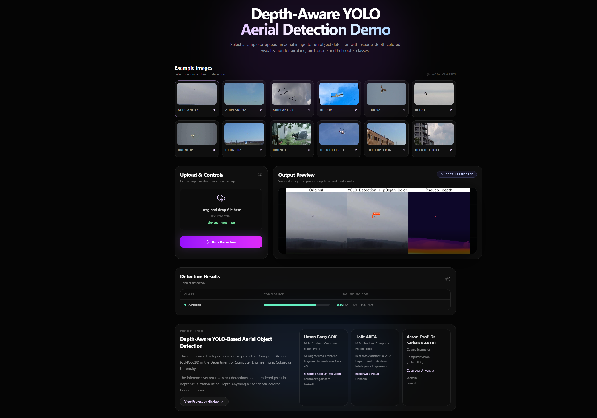
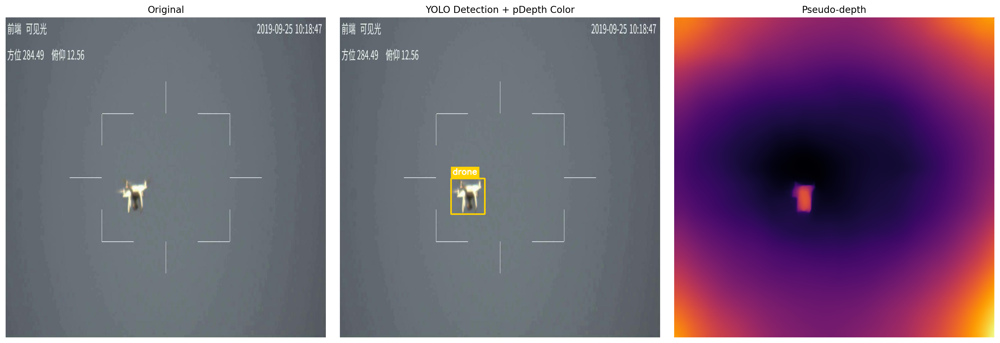
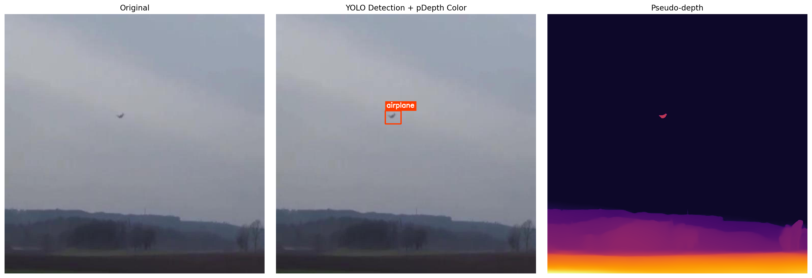
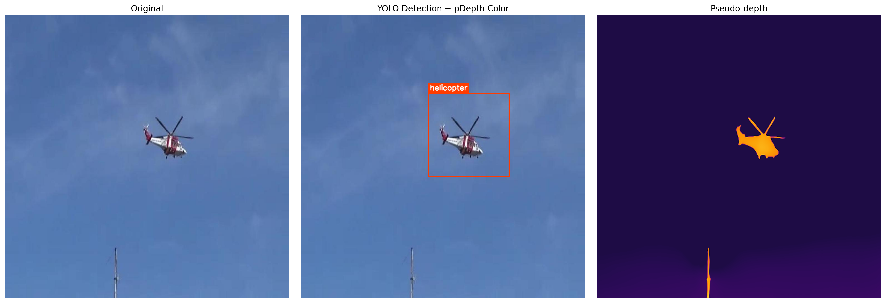
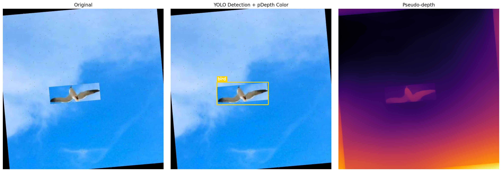

# Depth-Aware YOLO-Based Aerial Object Detection

Depth-aware aerial object detection for four aerial classes: `airplane`, `bird`, `drone`, and `helicopter`.

The current production path uses a YOLO OBB model for oriented detection and a pseudo-depth estimator for visualization. The FastAPI backend accepts a single image, runs object detection, optionally generates pseudo-depth, and returns frontend-ready Base64 image previews.

## Live Demo

- https://hasanbarisgok.com/aod4-demo

## Project Highlights

- YOLO OBB inference with polygon coordinates for oriented aerial objects
- Optional pseudo-depth visualization using Depth Anything
- FastAPI inference service for frontend integration
- Railway-ready Docker deployment
- Reproducible training scripts and curated final artifacts
- Representative test samples and visual result assets included in the repo

## Academic Context

Course: Computer Vision (`CENG0038`)  
Instructor: Assoc. Prof. Dr. Serkan KARTAL

Project team:

- Hasan Baris GOK, M.Sc. Student, Department of Computer Engineering, Cukurova University
- Halit AKCA, M.Sc. Student, Department of Computer Engineering, Cukurova University

## Current Production Model

The current API deployment uses:

```text
models/obb_ha_hb_best.pt
```

The checkpoint was trained as a YOLO OBB model with:

```text
task: obb
base model: yolo26m-obb.pt
image size: 640
batch size: 64
planned epochs: 100
completed epochs: 86
best epoch: 71
early stopping patience: 15
```

Training was run on Google Colab with an NVIDIA A100 GPU. The final run stopped through Ultralytics EarlyStopping after no validation improvement was observed for 15 consecutive epochs. The best checkpoint from epoch 71 was saved as `best.pt`, and both `best.pt` and `last.pt` were optimizer-stripped to 48.1 MB for inference/deployment.

Final validation environment:

```text
Ultralytics: 8.4.46
Python: 3.12.13
PyTorch: 2.10.0+cu128
GPU: NVIDIA A100-SXM4-40GB
Training time: 5.450 hours
Model summary: YOLO26m-obb, 142 fused layers, 21,200,987 parameters, 71.5 GFLOPs
```

Final validation metrics:

| Metric | Value |
| --- | ---: |
| Precision | `0.976` |
| Recall | `0.972` |
| mAP50 | `0.987` |
| mAP50-95 | `0.83686` |

Per-class validation breakdown:

| Class | Images | Instances | Precision | Recall | mAP50 | mAP50-95 |
| --- | ---: | ---: | ---: | ---: | ---: | ---: |
| all | `4514` | `6369` | `0.976` | `0.972` | `0.987` | `0.837` |
| airplane | `1119` | `1625` | `0.972` | `0.955` | `0.981` | `0.855` |
| bird | `638` | `1557` | `0.971` | `0.966` | `0.990` | `0.877` |
| drone | `1485` | `1602` | `0.978` | `0.981` | `0.983` | `0.804` |
| helicopter | `1158` | `1585` | `0.985` | `0.985` | `0.993` | `0.814` |

Validation speed on the A100 run:

| Stage | Time per image |
| --- | ---: |
| Preprocess | `0.1 ms` |
| Inference | `1.8 ms` |
| Loss | `0.0 ms` |
| Postprocess | `0.2 ms` |

YOLO26m reference profile used for the final test context:

| Model | Image Size | mAP50-95 | mAP50 | CPU ONNX Latency | A100 TensorRT Latency | Params (M) | FLOPs (B) |
| --- | ---: | ---: | ---: | ---: | ---: | ---: | ---: |
| YOLO26m | `640` | `53.1` | `52.5` | `220.0 +/- 1.4 ms` | `4.7 +/- 0.1 ms` | `20.4` | `68.2` |

The full epoch log is stored in:

```text
results/obb_ha_hb/metrics/results.csv
```

## Repository Layout

```text
AOD4_GitHub/
+-- configs/                         # legacy YOLO dataset config
+-- docs/
|   +-- assets/                      # README/demo images
+-- models/
|   +-- obb_ha_hb_best.pt            # production OBB checkpoint
|   +-- obb_ha_hb_last.pt            # final OBB training checkpoint
|   +-- aod4_total50_best.pt         # legacy axis-aligned YOLO checkpoint
|   +-- aod4_total50_last.pt
+-- notebooks/
|   +-- aod4_colab.ipynb
|   +-- OBB_HA_HB_colab.ipynb
+-- OBB_HA_HB/
|   +-- configs/                     # OBB training config
|   +-- scripts/                     # OBB dataset prep and training scripts
|   +-- README.md
+-- results/
|   +-- obb_ha_hb/
|   |   +-- metrics/                 # curves, confusion matrices, args, CSV
|   |   +-- samples/                 # train/validation batch previews
|   +-- dataset_distribution/        # dataset distribution plots
|   +-- yolov8_50epoch_baseline/     # earlier non-OBB YOLOv8 50-epoch baseline
+-- scripts/
|   +-- api_server.py                # FastAPI inference API
|   +-- depth_overlay.py             # pseudo-depth colored box/polygon rendering
|   +-- combined_demo.py             # offline detection + depth visualization
|   +-- depth_map_demo.py            # standalone pseudo-depth map generation
|   +-- detect_image.py              # single-image CLI inference
|   +-- run_sample_tests.py
|   +-- run_labeled_test_set.py
|   +-- analyze_image_sizes.py
|   +-- analyze_split_distribution.py
+-- tests/                           # small representative labeled samples
+-- Dockerfile
+-- requirements.txt
+-- requirements-railway.txt
```

## Visual Artifacts

Frontend example:



Offline combined pseudo-depth examples:

Each example is generated with `scripts/combined_demo.py` using the current `models/obb_ha_hb_best.pt` checkpoint. The panels show the original image, OBB detection with pseudo-depth-colored rendering, and the standalone pseudo-depth heatmap.

### Drone



### Airplane



### Helicopter



### Bird



Training curves and validation previews are under:

```text
results/obb_ha_hb/metrics/
results/obb_ha_hb/samples/
```

Earlier non-OBB YOLOv8 50-epoch baseline artifacts are preserved separately under:

```text
results/yolov8_50epoch_baseline/
```

## Local Setup

```powershell
python -m venv .venv
.\.venv\Scripts\Activate.ps1
python -m pip install --upgrade pip
python -m pip install -r requirements.txt
```

## Single-Image Inference

```powershell
python scripts/detect_image.py `
  --image "tests/data/drone/input.jpg" `
  --weights "models/obb_ha_hb_best.pt" `
  --output "outputs/drone_obb_prediction.jpg"
```

The script supports both standard YOLO boxes and OBB results. For OBB models it prints both `bbox_xyxy` and polygon coordinates.

## Pseudo-Depth Demo

Generate the three-panel visualization used by the project demo:

```powershell
python scripts/combined_demo.py `
  --image "tests/data/drone/input.jpg" `
  --weights "models/obb_ha_hb_best.pt" `
  --output "outputs/combined_depth_demo.png"
```

Generate only the pseudo-depth map:

```powershell
python scripts/depth_map_demo.py `
  --image "tests/data/drone/input.jpg" `
  --output "outputs/depth_map.png"
```

## API

Run locally:

```powershell
python scripts/api_server.py `
  --weights "models/obb_ha_hb_best.pt" `
  --host 127.0.0.1 `
  --port 8000
```

Available endpoints:

```text
GET  /
GET  /health
POST /predict
```

Example request:

```powershell
curl -X POST "http://127.0.0.1:8000/predict" `
  -F "image=@tests/data/drone/input.jpg" `
  -F "conf=0.25" `
  -F "render=true" `
  -F "render_depth=true"
```

Important response fields:

| Field | Description |
| --- | --- |
| `detections` | Class, confidence, axis-aligned `bbox_xyxy`, and optional OBB `polygon_xy` |
| `annotated_image_base64` | Frontend-ready image. With `render_depth=true`, this is the combined preview when depth succeeds |
| `depth_image_base64` | Standalone pseudo-depth heatmap when depth succeeds |
| `combined_image_base64` | Three-panel `Original / Detection + pDepth / Pseudo-depth` preview |
| `depth_rendered` | `true` when pseudo-depth finished successfully; `false` when the API falls back to normal YOLO rendering |

## Railway Deployment

The Docker deployment is intentionally narrow: it copies only the API code, the depth overlay helper, and the production OBB checkpoints.

Production defaults:

```text
MODEL_WEIGHTS=models/obb_ha_hb_best.pt
PORT=8000
```

Recommended Railway environment variables:

```text
CORS_ORIGINS=https://hasanbarisgok.com,https://www.hasanbarisgok.com
```

The deployment dependencies are pinned in:

```text
requirements-railway.txt
```

The Railway runtime uses CPU PyTorch wheels and is configured for FastAPI via:

```text
Dockerfile
```

## OBB Training Flow

OBB-specific training utilities live in:

```text
OBB_HA_HB/
```

See:

```text
OBB_HA_HB/README.md
```

The training artifacts from the final OBB run are stored in:

```text
results/obb_ha_hb/
```

## Test Assets

Representative labeled samples are included under:

```text
tests/data/
tests/predictions/
tests/summary.csv
```

These files are small, curated examples for local validation and README/demo usage. The full training dataset is intentionally not included in the repository.

## Dataset Source

Original dataset source:

- https://data.mendeley.com/datasets/cd5z895tr2/1

## Notes

- `models/aod4_total50_*.pt` and `results/yolov8_50epoch_baseline/` are retained as the earlier axis-aligned YOLOv8 50-epoch baseline.
- `models/obb_ha_hb_best.pt` is the current production checkpoint.
- The API keeps `bbox_xyxy` for frontend compatibility and adds `polygon_xy` when the active model is OBB.
