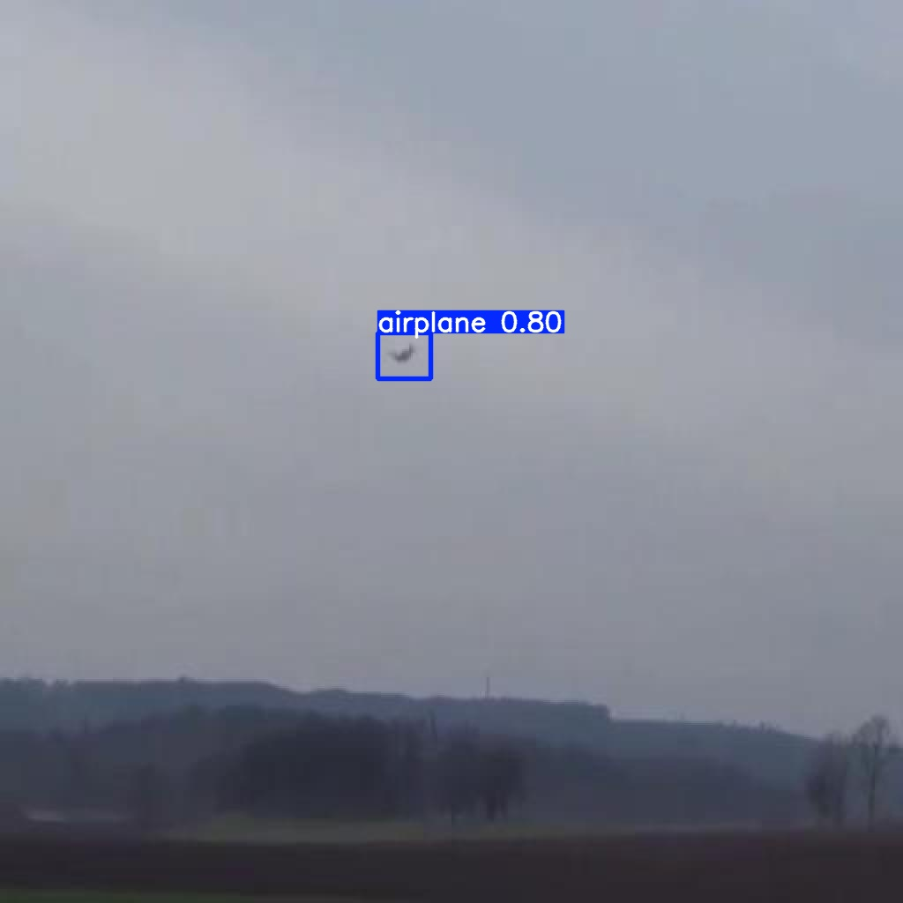
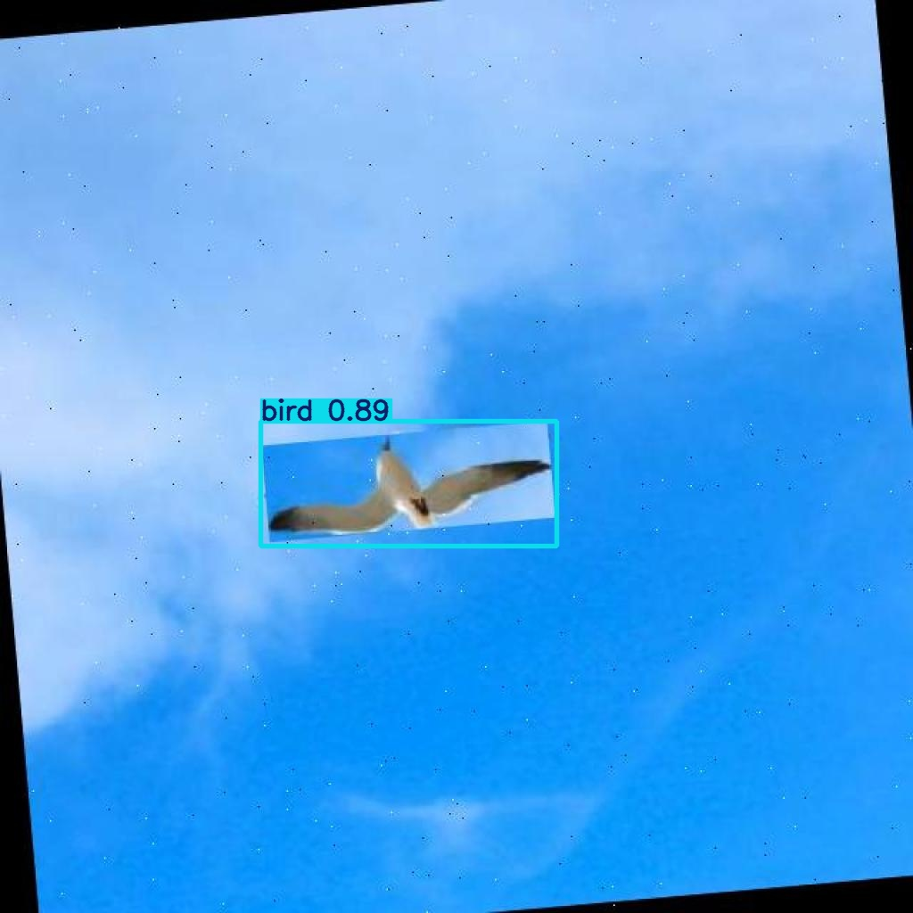
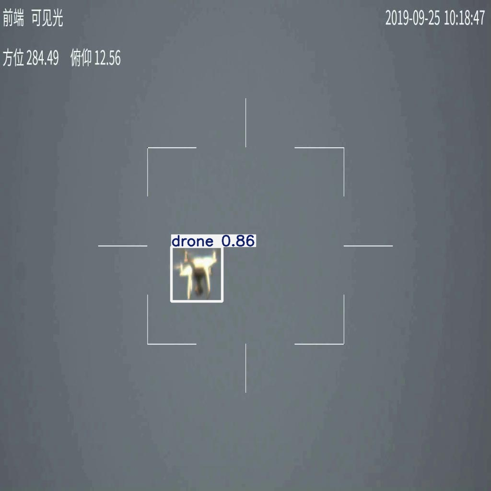
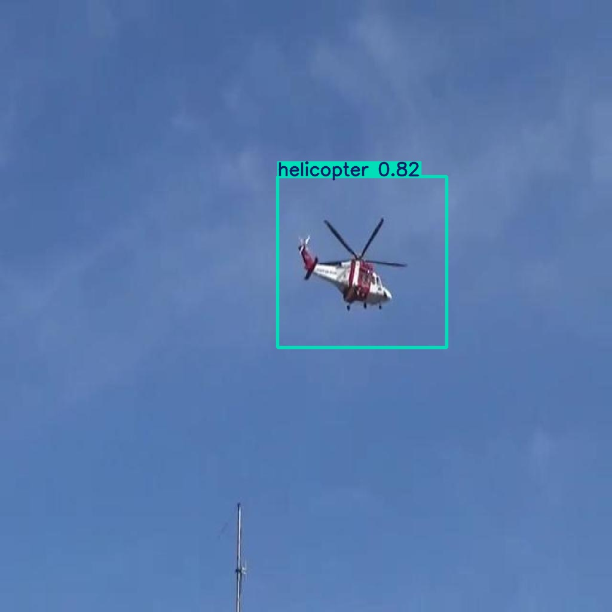

# Depth-Aware YOLO-Based Aerial Object Detection

This repository contains the final project structure for a YOLOv8-based aerial object detection pipeline with pseudo-depth visualization support.

## Project Scope

- Object detection with YOLOv8
- Single-image inference
- Pseudo-depth map generation
- Combined detection + depth demo
- Final trained model and sample test outputs

## Detected Classes

- airplane
- bird
- drone
- helicopter

## Repository Structure

- `configs/`: configuration files
- `scripts/`: training, inference, and test scripts
- `models/`: final trained model weights
- `results/`: final training statistics and sample output
- `tests/`: labeled sample test data and corresponding predictions
- `notebooks/`: Colab notebook
- `requirements.txt`: Python dependencies

## Training Setup

The final project is organized as a standard 50-epoch YOLOv8 training workflow.

Core training configuration:

- model: `yolov8n`
- epochs: `50`
- image size: `640`
- batch size: `16`
- device: `GPU`
- classes: `4`

Main training command:

```powershell
python scripts/train_yolo.py --model yolov8n.pt --epochs 50 --batch 16 --imgsz 640
```

## Final Model

- `models/aod4_total50_best.pt`: main final model
- `models/aod4_total50_last.pt`: last checkpoint

## Final Metrics

Final validation summary:

- Precision: `0.94087`
- Recall: `0.93935`
- mAP50: `0.96537`
- mAP50-95: `0.65577`

Class-level performance summary:

- airplane: `0.968 / 0.696`
- bird: `0.973 / 0.694`
- drone: `0.954 / 0.612`
- helicopter: `0.968 / 0.622`

Detailed epoch-wise statistics are stored in:

- `results/aod4_total50_results.csv`

## Inference

Example usage:

```powershell
python scripts/detect_image.py --image "tests/data/drone/input.jpg" --weights "models/aod4_total50_best.pt" --output "results/example_detection.jpg"
```

## API

The repository also includes a small FastAPI server for frontend integration.

Install dependencies and run the API:

```powershell
python -m venv .venv
.\.venv\Scripts\Activate.ps1
python -m pip install -r requirements.txt
python scripts/api_server.py --weights "models/aod4_total50_best.pt" --host 127.0.0.1 --port 8000
```

Available endpoints:

- `GET /health`: basic health check
- `POST /predict`: upload an image and receive detections as JSON

Example `curl` request:

```powershell
curl -X POST "http://127.0.0.1:8000/predict" `
  -F "image=@tests/data/drone/input.jpg" `
  -F "conf=0.25" `
  -F "render=true"
```

The `/predict` response includes:

- `detections`: class id, class name, confidence, and bounding box coordinates
- `annotated_image_base64`: optional rendered prediction image for direct frontend display

## Test Assets

This repository includes representative labeled test samples for all four classes:

- `tests/data/airplane`
- `tests/data/bird`
- `tests/data/drone`
- `tests/data/helicopter`

Predicted outputs for those same test samples are stored under:

- `tests/predictions/`

Prediction summary file:

- `tests/summary.csv`

## Sample Test Outputs

Representative prediction outputs for each class are included below:

### Airplane



### Bird



### Drone



### Helicopter



## Additional Scripts

- `scripts/prepare_dataset.py`: dataset structure generation
- `scripts/train_yolo.py`: training
- `scripts/detect_image.py`: single-image detection
- `scripts/depth_map_demo.py`: pseudo-depth generation
- `scripts/combined_demo.py`: combined detection + depth output
- `scripts/run_sample_tests.py`: labeled sample test execution
- `scripts/run_labeled_test_set.py`: full labeled test-set evaluation utility

## Dataset Source

The original dataset source used for this project can be found here:

- https://data.mendeley.com/datasets/cd5z895tr2/1

## Note

The full training dataset is intentionally not included in this repository to keep the project GitHub-friendly. Representative labeled test samples and final result artifacts are included instead.
